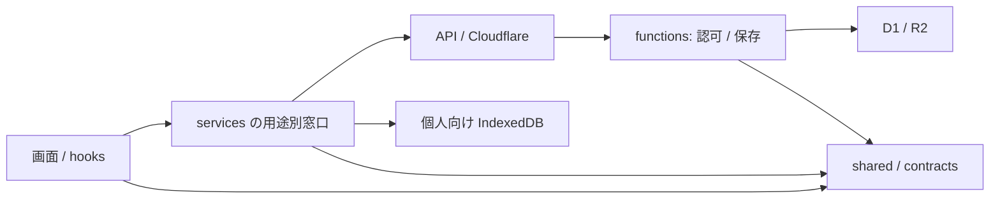

# アーキテクチャと状態・保存契約

更新日: 2026-09-07。再構築の判断と適用範囲を記す。ロードマップ全体の実装完了を意味しない。

## 依存方向

`shared` は実行環境に依存しない判定と契約。clientから`functions`を参照しない。serverから画面やclient実装を参照しない。純粋なmission選択は `shared/dashboardPrimaryMission.ts` に置く。`quality:architecture` で境界と循環を検査し、`quality:unused` で到達不能ソースを検査する。循環を許容するための包括的例外を足さない。

## 学習ホーム

取得は resource model に集約し、初回loading/errorと、有効snapshotを持つready/refreshing/errorを区別する。同一利用者の更新失敗は前回データを残して表示し、利用者変更時は前回データを引き継がない。リクエスト世代が古い応答は破棄する。

`shared/studentDashboardCommand.ts` が学習開始・プラン・教材作成・演習・セクション移動を判別unionで表す。viewModelがcommandを選び、Dashboardが実行し、Sectionsは再判断しない。主行動を一つ、補助行動を次の一件に絞り、詳細は必要時に開く。

## 学習セッション

読み込みに失敗した場合は空教材として終了しない。セッションの識別を変えたら進捗・ヒント・未確定回答をリセットし、古い読込結果・保存完了を新セッションへ反映しない。

回答操作はawait前に同期ロックする。同じカードの再試行ではattempt ID、評価、応答時間を固定し、保存確認後だけ次へ進む。最終回答の保存とXPの確認は別の状態。XPの応答が不明なら再加算せず、未確認を表示する。

D1・IDB・画面の出題数は `shared/studySession.ts` で整数1〜100語へ揃える。初回の対象語数から `shared/xp.ts` で基本XPと最大10日分のボーナスを求め、再出題は付与対象語数へ加えない。最大100語の最大ボーナスを含め2000XPまで受け付ける。これは入力の有限上限であり、サーバー算出・receiptによる一意な授与は次期の課題。

## 作文の返却と再提出

課題の最新状態と、各提出の返却状態を分ける。生徒へ返す `latestReleasedSubmissionId` は本人の課題に属し、公開済み教師評価と同じ提出の選択評価が確認できるものに限定する。新しい提出が処理中でも過去の返却を開ける。未返却の最新ID・教師メモ・未選択評価は公開しない。

同内容の教師返却再送は保存済みレビューの担当者と時刻を使って製品イベント・後処理を回復する。イベントは存在確認と挿入を1文で行い、ジョブは固定の重複排除キーを使う。後続提出や状態遷移後まで自動回復する永続outboxとは区別する。

## 保存の正本

Cloudflare/D1が本番の正本。IndexedDBは個人デモ・ローカル学習向けで、B2B機能の並行実装は追加しない。サーバーで認可・入力検証・教材整合性を確認する。

SRSは識別子付き回答と履歴更新を原子的に扱う。DB変更は新しいmigrationで加え、既存履歴を作り直さない。同じ利用者とattempt IDの再送は同じ回答として扱い、内容のすり替えは拒否する。トランザクションと条件付き更新で、別回答の競合と同じ回答の再送を区別する。派生集計の失敗を新しい回答に変換しない。

小テストはSRSとは別の`quiz_attempt_receipts`を使う。同じ利用者・`clientAttemptId`の内容をSHA-256で照合し、同内容の再送は元のreceipt、異内容は409を返す。履歴・QUIZイベント・指定されたCBT/和訳feedbackは一つのD1 batchで確定し、historyとCBTの全計算入力をCASで照合する。新クライアントは最初の解答IDと送信内容を再試行まで保持する。旧IDなしクライアントは204互換を維持し、複数要求の重複排除は保証しない。認可はreceipt再送でも毎回行う。

小テストのweakness/missionは確定後の派生投影。失敗はreceiptにPENDINGとして残り、同じ解答の再送で元のmission/日時を使って再構築する。回答receiptは投影の並行競合修復や自動outboxを保証しない。IDBは端末内の履歴・event・専用receiptを同一native transactionで保存し、transaction完了後にのみ返す。サーバーの認可やCBT/feedback永続化と同じ保証ではない。

missionは一意な単語集合で目標を評価する。丸めた表示率は達成判定に使用せず、全必須目標の実数で判定する。更新は保存前の進捗とのCASで行い、競合時は上限を設けて再読込・再計算する。完了やアーカイブを古い要求で巻き戻さない。

IDB v8への更新が旧タブに阻まれた場合は明示的に失敗し、旧タブの閉鎖と再読込を案内する。失敗後にopenが成功しても不要な接続を残さず、今後のversionchangeでは接続を閉じる。

## 未完の境界

English practice 全体のreceipt統一、XPのサーバー算出と一意な授与、Writing外部AI処理のclaim/lease、派生集計の永続outboxと自動修復は次期。SRSの修正で全保存経路のexactly-onceを保証したとは扱わない。IDB教材削除後の孤立履歴/receipt、in-memoryのmission、weaknessの競合投影と保存receiptの保持期限も未完の範囲。

## 品質・運用

必須CIの`verify`がPR sentinelを所有し、手動Smoke Sentinelは追加検証用。preview/prodは各配備候補について全ゲートを実行する。ローカルAPI/smokeへ本番credentialを渡さない。PRで古い実行を中止しても、稼働中のproduction配備は中止しない。

詳細は [運用手順](./deployment-ops-runbook.md)、実装・実測結果は [再構築計画](./analysis/rebuild-plan-2026-09-07.md)。
